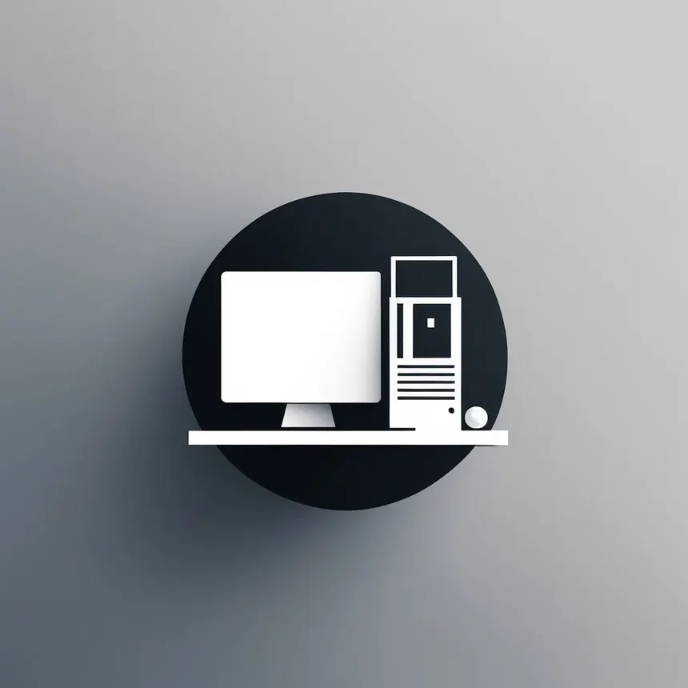

# Bureau Intelligent

  

  <strong>Un espace de travail connecté pour mieux s'organiser, mieux se tenir, mieux se concentrer.</strong> 
  Un système hybride Arduino et Java qui surveille la posture, rythme les sessions de travail et conserve un historique de l'activité.

  
  
  
  

---

## Description
Le Bureau Intelligent est un espace de travail destiné aux étudiants et aux employés afin d'améliorer leur organisation, leur posture et leur concentration. Il associe un dispositif matériel basé sur Arduino Uno à une application de bureau développée en Java, reliés par une communication série USB. Les données collectées par les capteurs sont transmises à l'application, exploitées en temps réel, puis enregistrées dans une base de données SQLite pour constituer un historique des sessions de travail.
## Problème Résolu
Les étudiants comme les employés perdent souvent en concentration et en confort au cours de longues sessions de travail, faute d'organisation claire et d'attention portée à leur posture. Le Bureau Intelligent répond à ce constat en combinant capteurs physiques et logiciel de gestion pour :
- structurer la journée de travail à l'aide d'un calendrier et d'une liste de tâches ;
- rappeler à l'utilisateur les tâches importantes à ne pas manquer ;
- détecter et signaler une mauvaise posture assise ;
- détecter l'absence de l'utilisateur pendant une session de travail ;
- imposer un rythme sain de travail et de pause, par exemple cinquante minutes de travail suivies de dix minutes de pause ;
- conserver une trace exploitable de l'activité, consultable sous forme d'historique.
## Architecture Matérielle
| Composant | Rôle |
|---|---|
| Arduino Uno | Unité centrale de contrôle des capteurs et actionneurs |
| Capteur DHT11 (facultatif) | Mesure de la température ambiante |
| Capteurs de pression FSR | Détection de la posture sur la chaise |
| Capteur ultrason HC-SR04 ou capteur PIR | Détection de présence devant le bureau |
| Écran LCD I2C | Affichage local d'informations telles que le statut ou le minuteur |
| Buzzer | Alerte sonore en cas de mauvaise posture, de fin de session ou de pause |
| LEDs | Indicateurs visuels d'état |
Les capteurs sont reliés à l'Arduino Uno, qui traite les signaux et les transmet à l'application Java via une communication série USB.
## Interface
L'application de bureau, développée en Java avec JavaFX ou Swing, constitue le point central d'interaction avec l'utilisateur. Elle permet de :
- planifier les tâches de la journée à l'aide d'un calendrier intégré ;
- afficher la liste des tâches à réaliser ;
- lancer une session de travail accompagnée d'un chronomètre ;
- recevoir des rappels concernant les tâches importantes ;
- afficher les alertes de posture transmises par les capteurs de la chaise ;
- afficher les alertes liées à une absence détectée pendant une session ;
- proposer automatiquement une pause à l'issue d'une durée de travail définie ;
- consulter l'historique des sessions de travail enregistrées dans la base de données SQLite.
---

  Conçu pour travailler mieux, assis droit, et sans perdre le fil.

